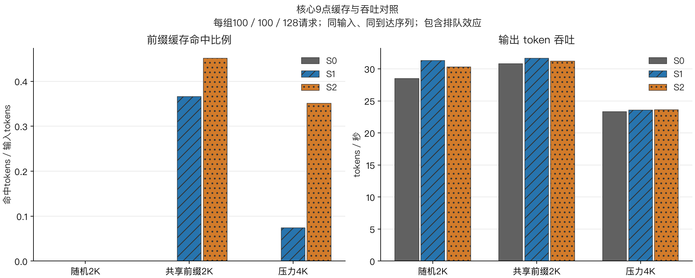
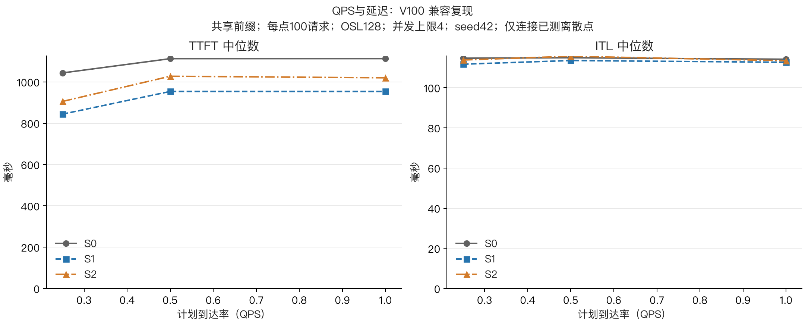
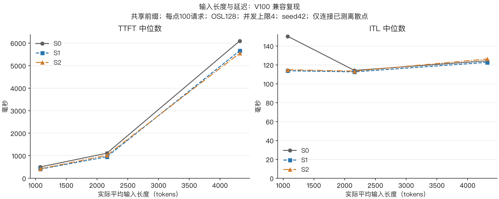
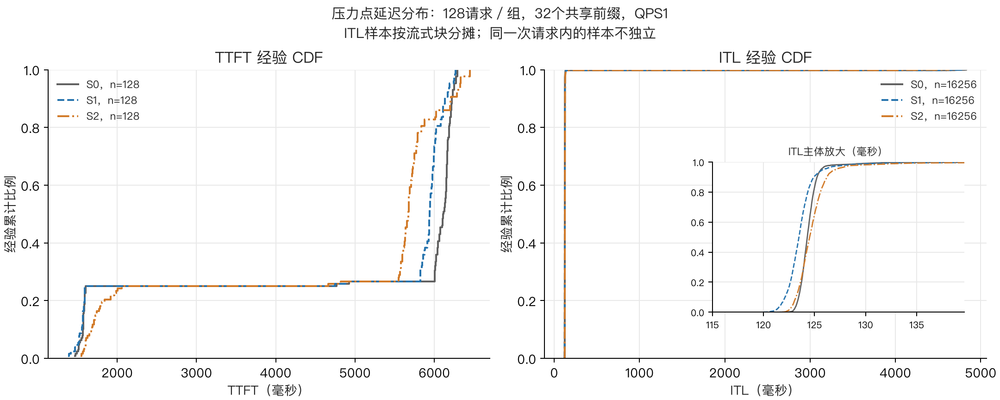
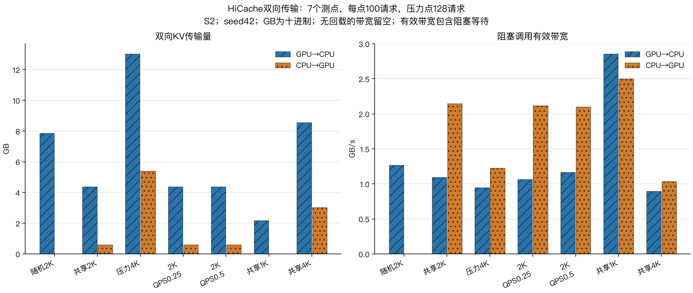

# 实验三：Benchmark 1 + SGLang 复现报告

## 技术摘要

本次完成 **S0 无前缀缓存、S1 Radix Cache、S2 HiCache** 三组 Benchmark 1 推理实验，共21个测点、2184个正式请求，全部成功，每个请求输出128 tokens。使用三张同型号、同规格的 **Tesla V100-SXM2-32GB**，每组独占一张GPU，三组并行运行。

本次复现验证了前缀缓存复用以及HiCache的CPU卸载、GPU驱逐和CPU→GPU回载机制。压力4K测点中，S1与S2的总复用比例分别为 **7.42%、35.14%**；S2实际回载146470 tokens，即5.399 GB的KV数据。S2的TTFT中位数比S1低4.52%，但p95高2.21%，输出吞吐仅高0.14%。因此，本轮证据支持“HiCache增加可复用缓存”，**不支持“HiCache在所有负载下都更快”**。

这是经确认的 **V100兼容复现**：模型使用未量化Qwen2.5-3B-Instruct，权重/KV为FP16，框架为SGLang 0.4.6.post5及native算子适配。不是原文GPTQ/AWQ模型、BF16 KV的严格原配置复现。验证状态为ANALYZED：原始数据已复算和核验，尚未进行独立GPU重复测量。

## 实验设置与测量范围

实验在2026年9月10日进行，S0约16:11启动，S1/S2约16:41启动，三组分别于17:11、17:38、17:40结束（UTC+8）。每张卡显存32 GiB、功率上限300 W，驱动580.173.02。主机提供20个vCPU，CPU型号为Intel Xeon Gold 6248。

三组共享主机CPU、内存与I/O；S0的前三个测点在另外两组启动前完成，后续测点有重叠。各组TP=1，GPU互不共享；没有把多卡张量并行引入缓存对照。

| 项目 | 本次实测设置 |
|---|---|
| 框架 / Python | SGLang 0.4.6.post5 / Python 3.12.3 |
| 模型 | Qwen/Qwen2.5-3B-Instruct，未量化，FP16 |
| PyTorch / Triton | 2.6.0+cu124 / 3.2.0 |
| attention / sampling | torch_native / pytorch |
| GPU KV池 | 28672 tokens × 36864 bytes/token = 1008 MiB |
| CPU KV池 | S2请求8 GiB，按完整token向下对齐；S0/S1没有CPU KV池 |
| KV dtype / 页大小 | FP16 / 1 token |
| 固定输出 / 并发上限 / seed | 128 tokens / 4 / 42 |
| 策略 | S1使用上游默认驱逐；S2为HiCache LRU，write_through_selective |
| 关闭的功能 | CUDA graph、overlap schedule、custom all-reduce、chunked prefill |

适配仅将RMSNorm、SiluAndMul、RotaryEmbedding切换到上游native实现，并为锁定的sm70/native配置放行旧版架构门槛；仍使用真实GPU能力值和上游缓存实现。另将旧版按十进制GB解释的HiCache参数换算为8 GiB。没有使用模拟缓存替代真实KV数据。

## 负载与计量口径

每个baseline运行下表7个测点。前三点构成核心9点对照，另外四点补齐QPS和输入长度曲线；没有执行所有建议QPS与并发值的全量交叉组合。

| 测点 | 模式 | 目标/实际平均ISL | QPS | 请求数 | 前缀组 |
|---|---|---|---|---|---|
| random_2k_q1 | random | 2048 / 2156.70 | 1 | 100 | 100 |
| prefix_2k_q1 | prefix_repetition | 2048 / 2159.72 | 1 | 100 | 10 |
| pressure_4k_q1 | prefix_repetition | 4096 / 4310.94 | 1 | 128 | 32 |
| prefix_2k_q025 | prefix_repetition | 2048 / 2159.72 | 0.25 | 100 | 10 |
| prefix_2k_q05 | prefix_repetition | 2048 / 2159.72 | 0.5 | 100 | 10 |
| prefix_1k_q1 | prefix_repetition | 1024 / 1074.95 | 1 | 100 | 10 |
| prefix_4k_q1 | prefix_repetition | 4096 / 4319.36 | 1 | 100 | 10 |

负载来自锁定版本的SGLang `sample_generated_shared_prefix_requests`。目标前缀与后缀各占输入长度的一半；random每请求独立前缀组，prefix_repetition在组内共享前缀。三个baseline读取相同数据文件、输入SHA256及Poisson计划到达序列。生成器将随机tokens解码为文本再编码，因此实际平均输入长度不是精确的1024/2048/4096，表中和长度曲线使用真实token统计。此合成负载用于缓存机制对照，不代表自然语言任务准确率。

每点先做4次预热、清空缓存，再进行正式测量，84次预热不计入2184次正式请求。温度为0，ignore_eos保证固定输出长度。

**延迟有两个起点，不能混用。** 主列TTFT/E2E从实际发送HTTP请求起算，包含服务器侧排队与处理；`offered_*`从计划到达时刻起算，还包含客户端等待并发槽的时间。QPS是计划到达率，不是实测接收率；并发上限4会在负载较高时积累客户端队列。本轮native路径的实测吞吐较低，不能把标注“QPS1”的结果当作服务器稳定承载1 req/s。

| 指标 | 定义与分母 |
|---|---|
| TTFT、E2E | HTTP发送到首个流式token块、到响应结束；报告均值及p50/p95/p99 |
| ITL | 相邻SSE块时间差/后一块新增tokens；保留全部分块数据，块内时间为平均分摊 |
| Prefill / Decode | 批次CUDA事件跨度及CPU调用跨度；不是单请求纯kernel时间 |
| 吞吐 | 请求数、输出tokens、逻辑input+output tokens除以正式测量墙钟时间 |
| Physical / Prefill吞吐 | 实际计算的prompt tokens加output除以墙钟；prompt tokens除以prefill批次CUDA跨度总和 |
| 总复用比例 | 请求meta_info.cached_tokens总和 / 实际输入tokens总和；S2包含GPU与CPU回载 |
| GPU / CPU KV占用 | 每批次已用tokens/对应池容量；提供采样均值和峰值，非时间加权均值 |
| Offload字节 / 时间 / 大小 | 两个方向分别记录原有阻塞tensor.to调用payload与时间，按测量窗口汇总 |
| 有效传输带宽 | payload总字节/阻塞拷贝调用总墙钟时间；GB为十进制，不是裸链路峰值 |

## 缓存复用增加，但性能收益取决于负载

随机2K中三个baseline的前缀复用均为0。S2仍发生7.871 GB的GPU→CPU写入，却没有CPU→GPU回载；其TTFT中位数比S1高12.41%。这表明在低复用负载下，需要同时核对“写出了多少”与“真正读回了多少”，不能用开启HiCache本身代替收益证据。

共享2K中，S1与S2的复用比例为36.58%和45.10%，但S2的TTFT中位数比S1高6.94%。压力4K中，S2的复用明显更多且中位TTFT更低，但输出吞吐差距很小。以下两张图分别看缓存和吞吐，不能把复用率直接当作加速比。

输出吞吐使用完整测量窗口作为分母，包含到达间隔与请求完成时间；它描述本次负载下的服务表现，不是V100或SGLang的理论峰值。不同负载不得汇总成一个“平均提升”来掩盖差异。

| 负载 | 组 | TTFT p50/p95(ms) | ITL p50(ms) | E2E p50(s) | 输出tokens/s | 总复用率 |
|---|---|---|---|---|---|---|
| 随机2K | S0 | 1115.84/1158.22 | 115.18 | 16.72 | 28.49 | 0.00% |
| 随机2K | S1 | 1112.69/1125.29 | 112.12 | 16.35 | 31.28 | 0.00% |
| 随机2K | S2 | 1250.77/1306.77 | 114.11 | 16.89 | 30.28 | 0.00% |
| 共享2K | S0 | 1112.59/1134.80 | 114.18 | 16.60 | 30.81 | 0.00% |
| 共享2K | S1 | 953.59/1085.80 | 112.66 | 16.17 | 31.63 | 36.58% |
| 共享2K | S2 | 1019.81/1117.98 | 113.44 | 16.34 | 31.20 | 45.10% |
| 压力4K | S0 | 6111.93/6250.92 | 124.29 | 21.94 | 23.33 | 0.00% |
| 压力4K | S1 | 5940.54/6189.25 | 123.47 | 21.71 | 23.59 | 7.42% |
| 压力4K | S2 | 5671.96/6325.92 | 124.52 | 21.55 | 23.62 | 35.14% |

## QPS与输入长度曲线

固定共享2K负载比较0.25、0.5、1三种计划QPS；固定QPS1比较1K、2K、4K目标输入长度。折线只连接实际测量的离散配置点，不拟合或外推。长度变化同时改变计算量与缓存压力，不是仅改变一种底层因素。

QPS曲线中的TTFT从HTTP发送起算。客户端等待另行记录，避免把大量等待时间藏在图外：共享2K、QPS1时，S0/S1/S2的客户端平均等待分别为151.54、146.18、149.22秒；这些值不属于上述HTTP口径TTFT。

ITL是流式块分摊后的token间隔，中位数接近并不意味着总请求时间或尾延迟相同，也不能将每个ITL样本当成独立实验重复。

4K输入的TTFT明显高于1K/2K。native attention路径和缓存容量共同影响这一形状；结论限定于本模型、本软件配置和所测输入长度。

长度与ITL也不是单调加速关系。所有21点的原始分位数均保留在汇总CSV中，没有删去不利点。

## 尾延迟没有随中位数同步改善

压力4K点每组128个请求。S1的TTFT p50/p95为5940.54/6189.25 ms，S2为5671.96/6325.92 ms。S2中位数低4.52%，但p95高2.21%，p99也高2.90%。因此，应分别报告中心与尾部，不将“中位数更低”写成“所有请求更快”。

HTML展示完整TTFT经验CDF；交付PNG还包含ITL经验CDF。CDF中的128个请求来自同一次运行，没有跨seed独立重复或置信区间。

## HiCache双向传输与回载成本

S2的7个正式测点共写出44.752 GB，读回10.244 GB；该合计只用于数据量核对，不用于跨负载性能比较。压力点写出13.035 GB、读回5.399 GB，并记录494019个GPU驱逐tokens与146470个host回载tokens。每token KV为36864 bytes，逐层传输字节与回载token计数精确一致。

GPU→CPU按打包批次测量，CPU→GPU按层测量，因此两个方向的操作次数和“单次大小”粒度不同。压力点两个方向的阻塞调用总时间分别为13.779秒、4.408秒；对应有效带宽为0.95和1.23 GB/s。时间包含运行时等待，不是纯DMA耗时，也没有假设传输可被计算完全隐藏。

没有发生回载的random点，H→D字节为0、带宽为不可用，而不是“0 GB/s性能”。详细表列出每方向字节、总时间、操作数、单次大小p50/p95/p99以及调用时间/CUDA事件两种带宽口径；后者也可能包含流间等待，不能当作裸PCIe带宽。

| 测点 | 方向 | GB | 调用总秒数 | GB/s | 操作数 | 单次MiB p50/p95 |
|---|---|---|---|---|---|---|
| 随机2K | GPU→CPU | 7.871 | 6.213 | 1.267 | 198 | 37.863/38.391 |
| 随机2K | CPU→GPU | 0.000 | 0.000 | 不可用 | 0 | 不可用/不可用 |
| 共享2K | GPU→CPU | 4.371 | 3.996 | 1.094 | 110 | 37.916/38.449 |
| 共享2K | CPU→GPU | 0.599 | 0.279 | 2.147 | 504 | 1.057/2.113 |
| 压力4K | GPU→CPU | 13.035 | 13.779 | 0.946 | 328 | 37.934/38.215 |
| 压力4K | CPU→GPU | 5.399 | 4.408 | 1.225 | 1620 | 2.116/6.307 |
| 2K/QPS0.25 | GPU→CPU | 4.371 | 4.102 | 1.065 | 110 | 37.916/38.449 |
| 2K/QPS0.25 | CPU→GPU | 0.599 | 0.283 | 2.119 | 504 | 1.057/2.113 |
| 2K/QPS0.5 | GPU→CPU | 4.371 | 3.751 | 1.165 | 110 | 37.916/38.449 |
| 2K/QPS0.5 | CPU→GPU | 0.599 | 0.285 | 2.101 | 504 | 1.057/2.113 |
| 共享1K | GPU→CPU | 2.183 | 0.764 | 2.858 | 103 | 18.949/37.631 |
| 共享1K | CPU→GPU | 0.020 | 0.008 | 2.502 | 36 | 0.519/0.519 |
| 共享4K | GPU→CPU | 8.552 | 9.535 | 0.897 | 215 | 37.969/38.320 |
| 共享4K | CPU→GPU | 3.028 | 2.919 | 1.037 | 1080 | 2.112/4.257 |

独立18请求机制探针先于正式实验运行，成功触发GPU驱逐、D→H、H→D和host复用。该探针采用精确4096 token输入、OSL16、并发1，与正式负载不同，不混入性能统计。

## 需求覆盖、验证与限制

已覆盖：S0/S1/S2 × random/prefix_repetition、1–4K长度、固定OSL128、三档QPS、warmup排除、延迟分位数、吞吐、分层KV占用、缓存复用、驱逐以及双向offload字节/时间/大小/带宽。需求对照表逐项列出字段和图表。

原始数据校验包括：数据集SHA256、实际输入token数、请求数与唯一ID、输出长度、S0零复用、batch内请求归属、批次输出计数、计算+缓存token会计、回载字节会计、三组代码及版本一致性。所有21点通过。依赖环境的pip check通过。

不能补算或未独立测量的项目包括：精确设备queue time、KV load stall、external query分母、reuse distance、overlap ratio与SLO goodput；I/O三阶段甘特图为可选，本次不绘制没有充分分解证据的请求级甘特图。Prefill/decode仅有批次跨度，不能替代纯kernel分析。8 GiB CPU池修正、native适配、旧版SGLang和非量化模型均已披露。

本轮为单seed、单次测量，三张相同规格GPU并行但未做卡间轮换；不提供显著性或普遍提升结论。模型指纹在实验后补采，下载时未记录不可变ModelScope提交号；交付保存权重与分词文件SHA256，重下载后必须校验。原环境只读借用了已有SEDS环境中的torch/triton，尚未验证全新机器从零安装。

## 复现结论与后续问题

本次交付完成了已确认范围内的V100兼容机制复现和描述性性能测量：缓存关闭、GPU前缀复用、CPU层卸载与回载都有真实记录。结果说明，“更多缓存命中”需要与复制成本、TTFT尾部和实际吞吐一起评估；HiCache不是当前所有负载的统一最优项。

若继续优化，优先研究低复用负载的无效写出，以及压力场景中额外复用为何没有转化成同等幅度的吞吐收益。严格性能因果比较还需要同卡轮换或多次重复，并测试更合适的到达率；原配置严格复现则需要支持对应量化与BF16栈的GPU。这些均为后续工作，不计入本次已经完成的实验结果。

## 代码与数据来源

需求依据为随包保存的《复现阶段.md》，分工为实验3。上游代码来自 [SGLang](https://github.com/sgl-project/sglang) 的0.4.6.post5安装包；模型来自 [ModelScope官方Qwen仓库](https://modelscope.cn/models/Qwen/Qwen2.5-3B-Instruct)。[AI-infra-project](https://github.com/Kadsoo/AI-infra-project) 仅作为此前交付形式参考，本报告的性能数值全部来自本次运行，不借用他人的实验结果。

交付包含实测源码、便携重跑入口、离线分析脚本、原始请求与事件、环境指纹、CSV/JSON汇总、图表、数据验收脚本和文件SHA256清单。原始结果只读保留；新GPU实验必须写入新目录，不覆盖本次证据。
